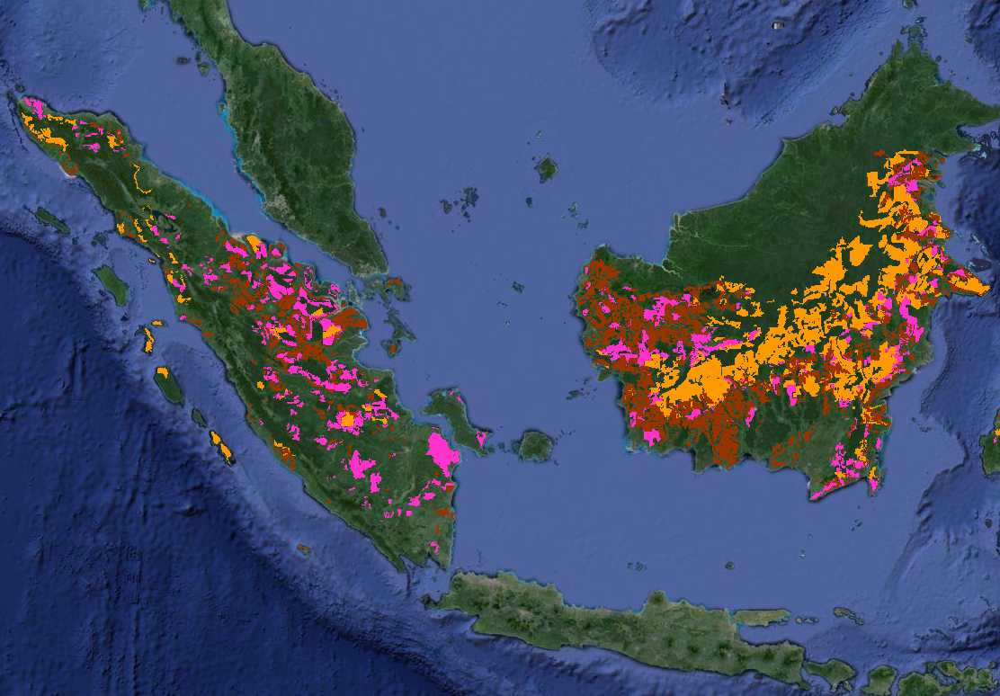

# Global Forest Change calculator

- [Table of Contents](#global-forest-change-calculator)
  - [Overview](#overview)
  - [Global Forest Change map](#global-forest-change-map)
  - [Basics](#basics)
  - [Usage](#usage)
  - [Input](#input)
  - [Algorithm](#algorithm)

## Overview
The script uses Hansen et al. (2013) Global Forest Change map in conjunction with Google Earth Engine to calculate forest cover in years 2000 - 2012 for a given set of species' distribution maps within provided altitude limits. 

## Global Forest Change map
Quantification of tree cover area and deforestation events from satellite imagery in a systematic way across the globe is a considerable challenge, which has been undertaken by group of prof. Hansen from Maryland University, in cooperation with Google team. The result, Global Forest Change (GFC) map, is a map product that provides estimates on forest cover in year 2000, as well as gain and loss events that happened until 2014 (as of version 1.2 of the map). The map has resolution 1296001 x 493200 pixels and a pixel size 30 metres. Since pixels are squares, a single pixel represents 30m * 30m = 900m2 area. 

## Basics
GFC map is composed of several bands (layers). Each layer is a separate image that represents a different piece of information. Here we will focus on four of them:
* **treecover2000**: percentage of tree cover in the pixel. In other words, each pixel has value from 0 till 100, with 0 meaning no forest at all and 100 full forest cover
* **loss**: pixel has value 1 if loss ever occurred during the study period.
* **gain**: pixel has value 1 if gain ever occurred during the study period.
* **lossyear**: value of a pixel denotes in which year loss occurred, starting with 2000. Ino other words, if pixel has value 5, then it means that the deforestation event occurred in 2005. 

It should be noted that Hansen et al. in their work used Food and Agriculture Organisation (UN) definition of a tree: any vegetation taller than 5 metres. In consequence, the GFC map captures as forest also any sort of plantations that happen to be taller than 5 metres. Although here we are using "trees" and "forest" interchangeably, it is important to stress that definition of "trees" does not imply ecological value. 

## Usage
The species' distribution maps are stored on Google Maps Engine (GME) server. Unfortunately GME does provide an option to share rasters publically and therefore running the script as-is will not succeed. Aim of sharing this code is to demonstrate how the calculations can be performed.

## Input
Required input:
* assets_filename: file with IDs of species' range maps (uploaded through GME)
* altitude_filename: comma-delimeted file in format species, min. altitude, max. altitude

## Algorithm
The algorithm of calculating tree cover in 2000 and forest loss is straightforward, since all the hard labour has already been done for us by Hanen et al., i.e. quantification of forest cover and identification of deforestation events from Landsat imagery. 

Put simply, our script just counts GFC pixels within distribution of a species. Let's take as an example *Bubo sumatranus*, a [barred eagle-owl](https://en.wikipedia.org/wiki/Barred_eagle-owl). First, we load distribution map of the species:

Using TOPO30 Digital Elevation Map we clip distribution map boundary to the altitude limits of the species. This way we obtain so-called Extent of Suitable Habitat, so all potential areas where species live and breed. On the illustration below we exaggerated the altitude limits, so that the picture is more clear.

The Global Forest Change map defines trees as any vegetation taller than 5 metres. Consequently, it also maps plantations, which we did not consider as suitable habitat. We removed these areas from our analysis, further reducing the extent of suitable habitat. The maps of concession areas were provided by the World Resources Institute and are in public domain. Yellow colour denotes wood logging, ping wood fibre and brown oil palm.

In turn we get so-called Extent of Suitable Habitat (ESH). The ESH is a maximum possible value for Area Of Occupancy.

Now that we know the habitat range, we can start calculating forest extent and loss over years. The GFC map quantifies with 30 m accuracy the percentage of forest cover over given pixel. In other words, a single pixel represents an area 30 by 30 metres wide. On the illustration below shades of green denote tree cover values from 1 to 100, with 100 being the light green. Calculation of tree cover is then a simple matter of summing all pixels within the species area.

Similar process applies to calculation of tree cover loss. Forest loss was defined as a stand-replacement disturbance or the complete removal of tree cover canopy at the Landsat pixel scale. The GFC map has two layers representing "loss": one provides gross tree loss ("loss" band) from 2000 till 2012 and the other yearly loss ("lossyear" band). Illustration below presents the gross tree loss: pixels marked in red mean that tree cover was lost in the given area. Since for a given pixel loss could occur in any year between 2000 and 2012, we can only estimate the forest cover in 2012. In our study, we assumed that all the original tree cover from 2000 within the pixel was lost. In other words, if tree cover in a pixel in 2000 was 70% and it was marked as "loss", we assumed 70% loss by 2012. 

The actual algorithm calculates forest loss for each year separately - the principles are the same. The output of the program constitutes of:
* Forest cover in 2000 within habitat of a given species.
* Forest loss from 2001 till 2012 within habitat of a given species.

From the forest loss one can infer habitat loss for forest-dependent species, but this part is beyond scope of the presented script. The described procedure is applied to all species as illustrated on a diagram below:

